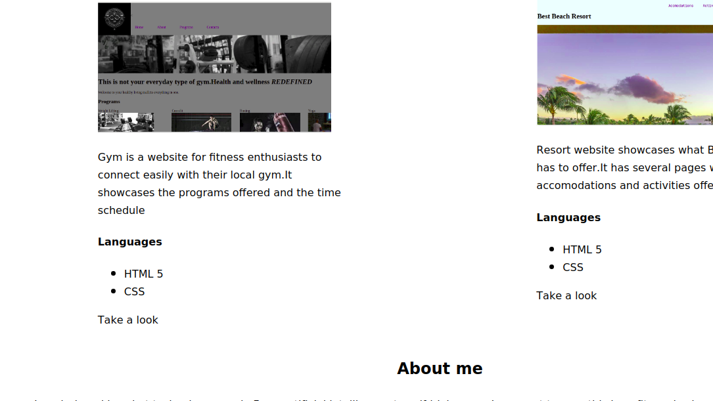

# My portfolio
#### The project is my portfolio page that says about me and showcases a sample of my work},{6th July 2019}.
#### By Ndundiro Kamau
## Description
This is a portfolio page made after my first week at Moringa School. It showcases what I have been able to do.
### screenshot 

## Setup/Installation Requirements
git  clone the files
or download a zip file of the project.
The files contained (html and css) should be able to open in a browse eg chrome.
Any changes can be made in a text editor. 
## Known Bugs
 No known bugs at the moment. 

## Technologies Used
* HTML
* CSS

## Support and contact details
Incase of enquiries,additional suggestions or concerns,get in touch.Email:ndundirokamau@gmail.com 

## License
 MIT License &copy;2019 Ndundiro Kamau 